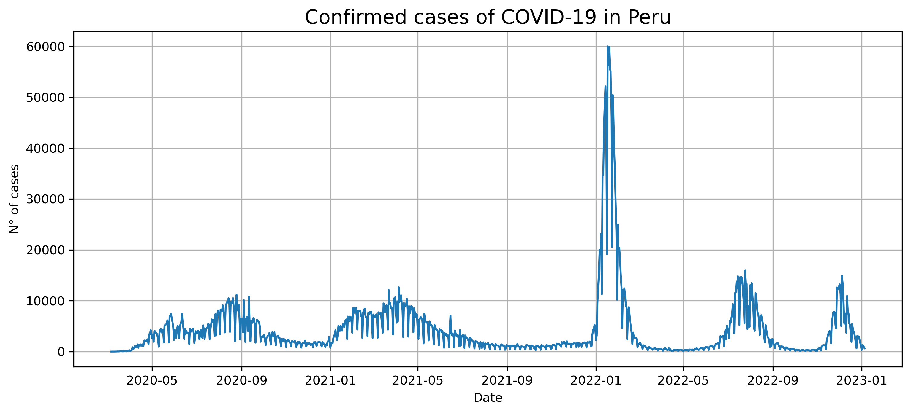

# Forecasting of COVID-19 cases in Peru
Implementation of a LSTM neural network to forecast number of confirmed cases of COVID-19 in Peru.

## Data & Pre-processing
Data was collected from the official [Peruvian government database of confirmed COVID-19 cases](https://www.datosabiertos.gob.pe/dataset/casos-positivos-por-covid-19-ministerio-de-salud-minsa). Data pre-processing was applied to obtain the final dataset used in the model.

### Note:
- Sklearn's [Robust Scaler](https://scikit-learn.org/stable/modules/generated/sklearn.preprocessing.RobustScaler.html#sklearn.preprocessing.RobustScaler) was used as the time series contained outliers and the more common alternatives (`MinMaxScaler` and `StandardScaler`) proved to be inadequate for this problem.

## Modeling
A straightforward LSTM model was implemented using the [`pytorch`](https://pytorch.org) framework and [`pytorch lightning`](https://www.pytorchlightning.ai)
